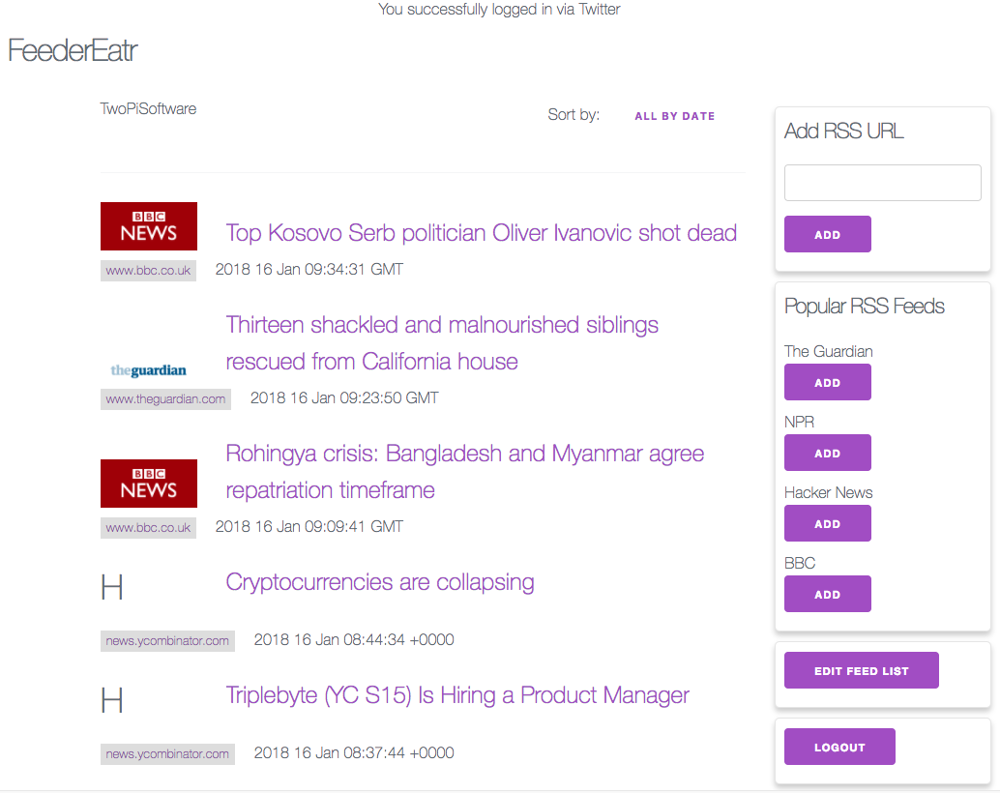

## Technical Requirements
* Build an app
* Uses authentication
* uses a remote api
* uses post, get, put, delete routes
* 

## Pictures / Stage Progress  

## Plan of Action
* Think about feeds to get
* Find XML parser
* attempt twitter auth
* find framework
* create databases
* login user
* add feeds
* delete feeds
* display feeds

## Libraries used  

* bcrypt
* Milligram framework
* (No jquery!)
* XMLDoc
* Mustache templating
* Express
* Sequelize
* https://github.com/fdaciuk/ajax

## What Was Difficult
* To get page updated as async calls were made, needed system to receive info
* Attempted Socket.io, but did not meet expectations
* created own server-client messaging system
* changing rank order of feeds
* parsing XML data feeds
* querying database
* mobile friendly
* Twitter Auth
* Sorting feeds chronologically

## What I Liked
* Parsing XML data
* Using Mustache was great!

## Oustanding Issues
* Add "to read" functionality
* Add limit to number from feed to view
* retain feed sort in session storage

## Future Ideas
* share feed publically
* inject user comments into feed
* etc...
